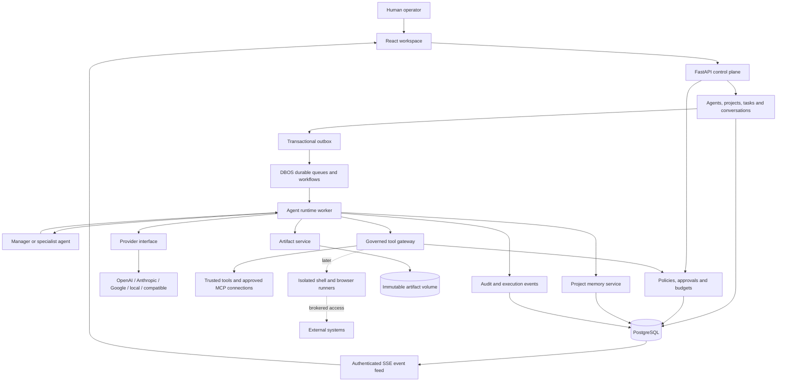

# System architecture

Status: approved architecture direction, subject to Phase 0 validation.

## Product boundary

A persistent agent is a configured worker identity, not a continuously running model session or dedicated container.

The Manager plans/delegates as an agent. The deterministic orchestrator admits work, governs transitions/limits and owns execution. Manager status cannot grant permissions or approve its own actions.

## Stack

| Layer | Choice | Reason |
|---|---|---|
| UI | React/TypeScript/Vite | Private app without SEO/SSR; static deployment |
| API | Python/FastAPI/Pydantic | Typed contracts, async integrations, agent ecosystem |
| Persistence | PostgreSQL/SQLAlchemy/Alembic | Transactions, durable records, migrations |
| Execution | Separate Python workers/DBOS | PostgreSQL workflows/waits/queues/schedules |
| Agent library | Pydantic AI behind app boundary | Typed execution, replaceable library |
| Memory | PostgreSQL facts/summaries/full-text | Minimal scope; pgvector when justified |
| Artifacts | Immutable Docker-volume files | Simple MVP; replaceable BlobStore |
| Realtime | SSE plus REST | Primarily server-to-client activity |
| Telemetry | Structured logs/OpenTelemetry | Portable, no mandatory hosted platform |

No Redis, Kubernetes, event broker, vector service, marketplace or billing initially.

## Components

One backend codebase: identity, projects/tasks, execution, providers, communication, tools, policy, approvals, memory, artifacts and audit.

API/worker are separate processes from the same image. Application services/database transactions connect modules.

MVP tools execute trusted code. Before model-generated code/shell, add isolated runners and credential brokerage. Runners must not receive app database credentials or unrestricted host access.

## Execution

1. Persist human objective, task revision and outbox event.
2. Dispatch workflow with stable execution ID.
3. Check pause, current permissions, limits and budget reservations.
4. Manager proposes bounded plan; deterministic code validates.
5. Specialists receive authorized context/memory/artifacts.
6. Gateway mediates all tools/delegation.
7. Persist immutable approval request and suspend durably.
8. Record results, versions and execution events.
9. Manager combines results; human review remains available.

## Events/realtime

Use relational state, transactional outbox and append-only audit; no full event sourcing.

Event envelope: ID/schema version/workspace sequence/type/timestamp/actor/project/task/execution/correlation/causation IDs/redacted payload.

Consumers tolerate duplicates. Use ordered committed workspace cursors to avoid transaction commit reordering loss. SSE resumes by cursor; expired cursor triggers a snapshot.

Token deltas are transient; completed messages/actions/outcomes are durable. Do not persist hidden chain-of-thought.

## UI

Initial navigation: Projects, Agents, Approvals, Activity, Settings.

Project view: objective, board, team thread, artifacts, execution timeline. Global Conversations/Schedules/Integrations pages follow later.

Board columns project task state, not engine mechanics. Waiting shows actual reason. Pause/cancel, approvals and cost stay visible.

Human intervention creates auditable instruction/revision; never silently rewrites history.
